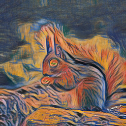
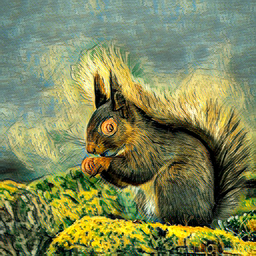
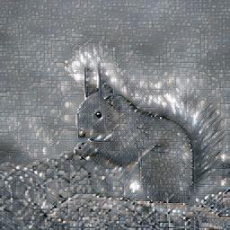

# TxST (Arbitrary text driven artistic style transfer)

[](https://colab.research.google.com/drive/1RO_gZBqSHoNWt-lo8oaw5NBI2E3dXASi?usp=sharing)<br>

If the above does not work, try the following one.

[](https://colab.research.google.com/drive/12qK4Tu50DnwfrXA1h4cdUt7LWtpBatwN?usp=sharing)<br>


Text-driven image style transfer (TxST) that leverages advanced image-text encoders to control arbitrary style transfer.

By Zhi-Song Liu, Li-Wen Wang, Wan-Chi Siu and Vicky Kalogeiton

This repo only provides simple testing codes and pretrained models.

Please check our [paper (30.2Mb)](https://arxiv.org/pdf/2202.13562.pdf) or [compressed version (3.2Mb)](https://drive.google.com/file/d/1s_EVyZSPxfsCR7JxIE7qJ76vIYbKLrM-/view?usp=sharing).
```text
@article{liu2022name,
  title={Name Your Style: An Arbitrary Artist-aware Image Style Transfer},
  author={Liu, Zhi-Song and Wang, Li-Wen and Siu, Wan-Chi and Kalogeiton, Vicky},
  journal={arXiv preprint arXiv:2202.13562},
  year={2022}
}
```

# Requirements
- Ubuntu 20.04 (18.04 or higher)
- NVIDIA GPU

# Dependencies
- Python 3.8 (> 3.0)
- PyTorch 1.8.2 (>= 1.8)
- NVIDIA GPU + CUDA 10.2 (or >=11.0)

Or you may create a new virtual python environment using Conda, as follows

```shell
conda create --name TxST python=3.8 -y
conda activate TxST
conda install pytorch torchvision torchaudio cudatoolkit=10.2 -c pytorch-lts -y
```

# Installation

## First, install additional dependencies by running

```sh
$ pip install -r requirements.txt
```

## Second, install [CLIP](https://github.com/openai/CLIP)

Please use the following command for installation, as we have modified the [model.py](https://drive.google.com/file/d/1h-Wh6tUGf9OTrGkJSAyvZRymTfQXc--O/view?usp=sharing) for intermediate features.

```sh
$ pip install ./lib/CLIP
```

# Testing
## Download Model Files
### 1. Pre-trained Models
You can simply run the following commands:
```shell
wget --load-cookies /tmp/cookies.txt "https://docs.google.com/uc?export=download&confirm=$(wget --quiet --save-cookies /tmp/cookies.txt --keep-session-cookies --no-check-certificate 'https://docs.google.com/uc?export=download&id=1lQm5MGpPV1154MbtvGQDZlCMx2D8beHr' -O- | sed -rn 's/.*confirm=([0-9A-Za-z_]+).*/\1\n/p')&id=1lQm5MGpPV1154MbtvGQDZlCMx2D8beHr" -O models/tmp.zip && rm -rf /tmp/cookies.txt
unzip ./models/tmp.zip -d models
rm ./models/tmp.zip
```
The files under "./models" are like:
```text
├── models
│   ├── readme.txt
│   ├── texture.ckpt
│   ├── wikiart_all.ckpt
│   └── wikiart_subset.ckpt
```

Or you can manually download them from [here](https://drive.google.com/file/d/1lQm5MGpPV1154MbtvGQDZlCMx2D8beHr/view?usp=sharing).

### 2. Pre-trained VGG Model
You can simply run the following commands:
```shell
wget --no-check-certificate 'https://docs.google.com/uc?export=download&id=19ZbeHK2UxzzTNeDMcWfE1TbyFkBUurns' -O pretrained_models/vgg_normalised.pth
```
The files under "./pretrained_models" are like:
```text
├── pretrained_models
│   ├── readme.txt
│   └── vgg_normalised.pth
```

Or you can manually download them from [here](https://drive.google.com/file/d/19ZbeHK2UxzzTNeDMcWfE1TbyFkBUurns/view?usp=sharing).

## Artist Style Transfer using Reference Images

put your content images under "data/content" and put your style images under "data/style"

then run the following script.

```sh
$ python eval_ST_img.py
```

the results are saved at "output" folder, like


## Artist Style Transfer using Texts

run
> You can find some **artists' names** from wikiauthors.txt file.
```sh
$ python demo_edit_art_style.py --content %path-to-your-content-image% --style %artistic-text%

# Example
python demo_edit_art_style.py --content data/content/14.jpg --style vangogh
```
the results are saved at "output" folder, like:



## Texture Style Transfer using Texts

run

```sh
$ python demo_edit_texture_style.py --content %path-to-your-content-image% --style %texture-text%

# Example
python demo_edit_texture_style.py --content data/content/14.jpg --style grid
```
the results are saved at "output" folder, like:


# Visualization

Here we show some cases on Wikiart style transfer using just texts as style description. We first compare with
state-of-the-art CLIP based approach [CLIPstyler](https://arxiv.org/abs/2112.00374). We have better artistic stylization
and consistent style changes.


We also use more artists's names for style transfer.

